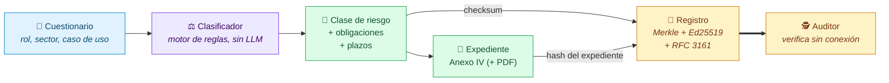
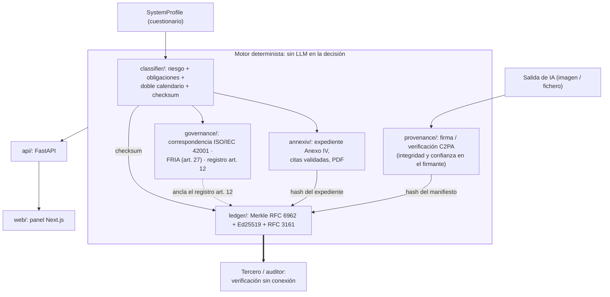
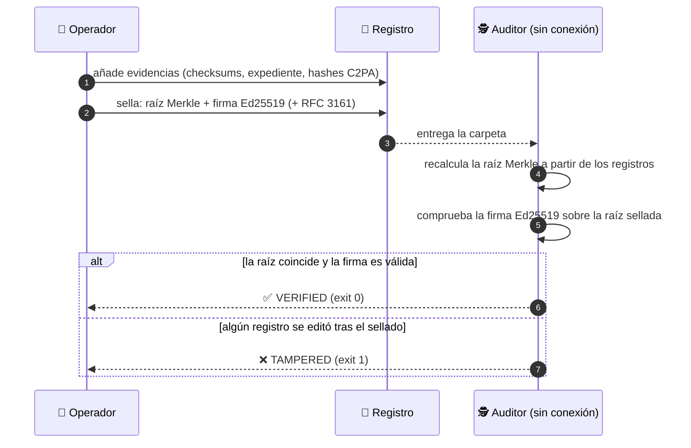
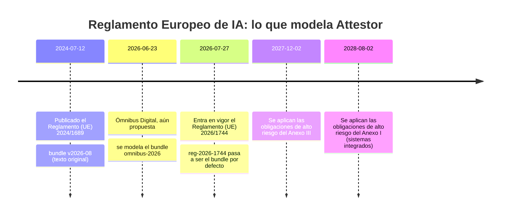

<div align="center">

# 🛡️ Attestor

### Cumplimiento automatizado del Reglamento Europeo de IA, con evidencias que cualquiera puede verificar sin conexión.

**Describe un sistema de IA → obtén su clase de riesgo legal, sus obligaciones y sus plazos, un
expediente técnico del Anexo IV listo para completar y un recibo criptográfico que cualquiera puede verificar
sin conexión.**

[🇬🇧 English](README.md) · 🇪🇸 **Español**

[](https://github.com/marcosmatalab/attestor/actions/workflows/ci.yml)
[](https://github.com/marcosmatalab/attestor/releases)
[](pyproject.toml)
[](LICENSE)


</div>

---

## ⚡ En 30 segundos

| | |
|---|---|
| 🎯 **El problema** | El Reglamento Europeo de IA (AI Act) clasifica los sistemas de IA por riesgo, y cada clase conlleva obligaciones con sus propios plazos legales. Las empresas tienen que demostrar qué decidieron, cuándo y con qué base jurídica. |
| 🧠 **Qué hace Attestor** | Un **motor de reglas** (sin LLM) convierte un cuestionario breve en una clase de riesgo, la lista de obligaciones aplicables y la fecha en que cada una es exigible, además del **expediente técnico del Anexo IV** (la documentación que exige el Reglamento) en PDF, con todas las citas legales verificadas. |
| 🔐 **Por qué es fiable** | Cada resultado lleva un **checksum reproducible** que puede sellarse en un **registro criptográfico** (árbol Merkle firmado con Ed25519, sello de tiempo RFC 3161 opcional). Un auditor lo verifica **sin conexión**, con un solo comando. |
| 🖼️ **Además** | Firma contenido generado por IA con **C2PA Content Credentials** (el marcado legible por máquina del art. 50(2)) y relaciona el resultado con **ISO/IEC 42001**, la **evaluación de impacto en los derechos fundamentales** (FRIA, art. 27) y el registro del **art. 12**. |

<div align="center">


<sub>Captura real de la aplicación en ejecución. El checksum que aparece es el que
<code>attestor classify</code> reproduce hoy, y un test hace fallar la CI si alguna vez deja de coincidir.</sub>

</div>

## 📊 De un vistazo

<div align="center">

| ✅ Tests Python | 📈 Cobertura | 🧪 Tests frontend | 🔎 Errores de tipos | 🧹 Código muerto | ⚓ Digests anclados |
|:---:|:---:|:---:|:---:|:---:|:---:|
| **417** en verde | **97 %** (umbral CI: 95 %) | **20** en verde | **0** · mypy strict | **0** hallazgos | **27** SHA-256 literales |

| 🤖 LLMs en la decisión | 🌐 Llamadas de red al verificar | 📜 Escenarios regulatorios | 🔁 Misma entrada, misma salida |
|:---:|:---:|:---:|:---:|
| **0** · garantizado por un test automático | **0** · garantizado por un test automático | **3** bundles (2 congelados · 1 en vigor) | **1** checksum · idéntico byte a byte en cada ejecución |

</div>

Cada cifra se reproduce con un comando de [Calidad de ingeniería](#calidad-de-ingenieria) o de
[Cada afirmación tiene su comando](#cada-afirmacion-tiene-su-comando), y la CI vuelve a ejecutar
los tests y los controles de calidad en cada push.

## 🧭 Cómo funciona



1. **Clasificar.** Las respuestas pasan por reglas YAML versionadas. El resultado es un nivel de
   riesgo (🔴 prohibido · 🟠 alto · 🟡 limitado · 🟢 mínimo), cada obligación con su propia
   fecha de aplicación y un checksum SHA-256 de la decisión en forma canónica.
2. **Documentar.** Los proveedores de alto riesgo obtienen el expediente del Anexo IV. Cada cita
   legal se valida contra el bundle, y el PDF se genera de forma **determinista** (modo invariante de reportlab, comprobado byte a byte en los tests).
3. **Sellar.** Los registros con el checksum, el hash del expediente y el hash del manifiesto
   C2PA se convierten en hojas de un árbol Merkle RFC 6962. La raíz se firma con Ed25519 y
   puede llevar un sello de tiempo RFC 3161.
4. **Verificar.** Cualquiera con la carpeta del registro ejecuta `attestor ledger verify` sin
   claves y sin red, y obtiene un código de salida: `0` íntegro, `1` manipulado.

<details>
<summary><b>🏛️ Arquitectura completa por módulos</b></summary>

<br/>

Cada caja dentro del motor es un paquete real de [`src/attestor/`](src/attestor). Las capas HTTP y de interfaz solo
muestran lo que produce el motor, y un test comprueba que el motor nunca las importa.



</details>

## 🚀 Pruébalo en 60 segundos

Sin claves, sin configuración y sin red tras la instalación:

```bash
git clone https://github.com/marcosmatalab/attestor.git && cd attestor
pip install -e ".[dev]"

# 1️⃣  Verifica sin conexión el registro incluido en el repositorio
attestor ledger verify examples/ledger
# ledger VERIFIED (Merkle root intact, Ed25519 signature valid) … -> exit 0

# 2️⃣  Cambia un byte de la evidencia y observa cómo cambia el veredicto
sed -i 's/sys-1/sys-9/' examples/ledger/records.json      # macOS: sed -i ''
attestor ledger verify examples/ledger
# ledger TAMPERED - integrity_ok=False, signature_ok=True         -> exit 1
git checkout examples/ledger/records.json

# 3️⃣  Reproduce el checksum de una clasificación, con dos versiones de la ley
attestor classify --role provider --annex-iii-area employment --checksum-only
# d821e3e0b95d4edda4416916f2a5b02ef0296f34704a0010ee0222b3a9e0ee48   (ley en vigor)
attestor classify --role provider --annex-iii-area employment --bundle v2026-08 --checksum-only
# 15815cd8f577dea7cc09696acc9a3e96870664573ea428e7c81bb8b06a84bd17   (texto original)

# 4️⃣  El pipeline completo, de principio a fin
attestor demo
```

> [!TIP]
> En el paso 2, `integrity_ok` pasa a falso mientras `signature_ok` sigue en verdadero. El
> registro distingue **«la evidencia se modificó después del sellado»** de **«la firma es
> falsa»**: dos fallos distintos, que se señalan por separado.



<a id="cada-afirmacion-tiene-su-comando"></a>

## ✅ Cada afirmación tiene su comando

| Afirmación | Comando | Resultado esperado |
|---|---|---|
| 🔁 La decisión es determinista | `attestor classify --role provider --annex-iii-area employment --checksum-only`, dos veces | El mismo checksum `d821e3e0…ee48` las dos veces |
| 🤖 No hay ningún LLM en la decisión | `pytest tests/test_architecture.py -k llm` | Recorre el AST de cada módulo del motor; importar un SDK de LLM hace fallar la CI |
| 🧱 El motor nunca importa la capa API | `pytest tests/test_architecture.py -k api_layer` | Las dependencias van en un solo sentido, comprobado por un test |
| 📜 Una ley nueva no cambió ningún caso de prueba de referencia | `pytest tests/test_regulatory_evolution.py` | Los dos bundles históricos conservan sus hashes de junio de 2026 |
| ⚓ Los checksums están anclados a digests literales | `pytest tests/test_checksum_anchors.py` | 27 valores SHA-256 versionados en el repo |
| 🖼️ La captura coincide hoy con el motor | `pytest tests/test_dashboard_capture.py` | El checksum incrustado en el PNG es igual a un `classify()` en vivo |
| 🧰 Toda herramienta que usan los controles está declarada | `pytest tests/test_tooling_declared.py` | Analiza el Makefile contra el extra `dev` |
| 🕵️ Un tercero verifica el registro sin conexión | `attestor ledger verify examples/ledger` | `ledger VERIFIED …`, exit 0, sin red |
| 🚨 La manipulación se detecta | cambia un byte de `examples/ledger/records.json` y repite | `ledger TAMPERED …`, exit 1 |
| 🪪 Integridad y confianza se notifican por separado | `attestor demo` | `integrity Valid …; signer UNTRUSTED …` (el certificado de demo se marca correctamente como no incluido en ninguna lista de confianza) |
| 🌐 La suite completa se ejecuta sin red | `python scripts/run_offline.py` | 417 en verde, toda conexión saliente rechazada |

Cada uno de estos controles se ha comprobado rompiéndolo a propósito: un `import httpx` en el
clasificador hace fallar el test de arquitectura, una fecha editada hace fallar nueve anclas de
checksum, quitar una línea del extra `dev` hace fallar el test de herramientas, y editar el
fichero de metadatos de la captura hace fallar el test de captura.

## 📅 La ley cambió. El motor no tuvo que hacerlo.



| Bundle | Qué es | Estado |
|---|---|---|
| `v2026-08` | Reglamento (UE) 2024/1689 en su texto original | 🧊 Congelado, histórico |
| `omnibus-2026` | El Ómnibus Digital modelado el 23 de junio de 2026, cuando aún era propuesta | 🧊 Congelado, histórico |
| `reg-2026-1744` | Reglamento 2024/1689 modificado por el Reglamento 2026/1744 | 🟢 **En vigor, y el bundle por defecto** |

La modificación se modeló cuando todavía era una propuesta. Al convertirse en ley el modelo
coincidió, e incorporarla costó **un fichero de bundle nuevo y un valor por defecto cambiado**:
ningún cambio en el motor, ninguna migración, ningún caso de prueba de referencia reescrito.

No fue suerte, fue diseño. Las fechas de aplicación viven **en cada obligación**, nunca como una
única fecha global, así que una modificación que mueve unos plazos y otros no es aditiva por
construcción. Historia completa en [`docs/regulatory-changelog.md`](docs/regulatory-changelog.md).

## 🧠 Decisiones de diseño clave

| Decisión | Por qué importa |
|---|---|
| 📆 **Fechas de aplicación por obligación**, no una fecha global | Un reglamento nuevo se incorporó añadiendo un fichero, sin reescribir el motor |
| ⚖️ **Motor de reglas, no un LLM**, para la decisión legal | Misma entrada, misma salida, mismo checksum: es lo que hace posible una pista de auditoría |
| 🪪 **Integridad y confianza como dos ejes separados**, en C2PA y en RFC 3161 | Un firmante no reconocido nunca se confunde con un fichero manipulado |
| 🧬 **Los campos con valor por defecto quedan fuera de la forma canónica** | Añadir preguntas al cuestionario no cambia el checksum de entradas anteriores |
| 🧾 **Los códigos de salida son la interfaz** | Un pipeline de CI o el script de un auditor decide con `0`/`1`, sin analizar texto |
| 🖨️ **Expediente y PDF deterministas** | Las mismas entradas producen siempre el mismo expediente, cuyo hash canónico se sella en el registro |

<a id="calidad-de-ingenieria"></a>

## 🏗️ Calidad de ingeniería

| | Medido | Comando |
|---|---|---|
| 🧪 Tests Python | **417 en verde** | `pytest` |
| 📈 Cobertura | **97 %** de 1.178 instrucciones, umbral de CI en el 95 % | `make test` |
| ⚛️ Tests frontend | **20 en verde** en 7 ficheros | `cd web && npm test` |
| 🔎 Tipos | mypy **strict, 0 errores** en 36 módulos | `mypy src/attestor` |
| 🧹 Código muerto | **0 hallazgos** | `vulture src tests --min-confidence 80` |
| ✨ Lint y formato | limpio, `ruff` fijado a versión exacta | `ruff check . && ruff format --check .` |

La CI ejecuta `make check`, de modo que el workflow y el Makefile no pueden divergir, además de
ESLint, build, `tsc` y Vitest del frontend, todos bloqueantes. Las herramientas de Python están
fijadas a versiones exactas, el frontend queda bloqueado por `package-lock.json` y las GitHub
Actions están fijadas a SHAs de commit.

## 💻 Ejecútalo en local

```bash
python -m venv .venv && source .venv/bin/activate   # Windows: .venv\Scripts\activate
pip install -e ".[dev]"

attestor demo                             # el pipeline completo, sin claves ni red
uvicorn attestor.api.main:app --reload    # API en http://127.0.0.1:8000
make check                                # todos los controles Python de la CI, en su orden
```

El panel es una aplicación Next.js sobre la misma API, en inglés y en español:

```bash
cd web && npm install && npm run dev      # http://localhost:3000
make web                                  # lint, build, typecheck, vitest
```

La configuración se lee del entorno o de un `.env` local; consulta
[`.env.example`](.env.example).

## 🛠️ Stack

| Capa | Tecnología |
|---|---|
| ⚖️ Clasificador y Anexo IV | Motor de reglas determinista en Python sobre bundles YAML versionados; citas validadas contra el bundle |
| 🖼️ Procedencia de contenido | `c2pa-python` (`Builder`, `Reader`), firma a través de una interfaz intercambiable `Signer.from_callback` |
| 🔗 Registro y sellado de tiempo | Ed25519 y árbol Merkle RFC 6962 (`cryptography`), tokens RFC 3161 (`rfc3161-client`) |
| 🏛️ Gobernanza | Correspondencia con ISO/IEC 42001, plantilla de FRIA (art. 27), registros del art. 12 |
| 🌐 API y frontend | FastAPI; Next.js 16 (App Router, React 19), bilingüe EN/ES |
| 📄 PDF | reportlab en modo invariante, salida idéntica byte a byte |

## 📚 Documentación

La documentación técnica está en inglés.

| Documento | Qué cubre |
|---|---|
| [`docs/classifier.md`](docs/classifier.md) | El motor de reglas y el esquema de los bundles |
| [`docs/timeline.md`](docs/timeline.md) · [`docs/regulatory-changelog.md`](docs/regulatory-changelog.md) | Comparar calendarios; cómo cambió la ley y cómo la absorbieron los bundles |
| [`docs/annex-iv.md`](docs/annex-iv.md) | El expediente del Anexo IV y la validación de citas |
| [`docs/provenance.md`](docs/provenance.md) | Firma y verificación C2PA |
| [`docs/ledger.md`](docs/ledger.md) | Merkle, Ed25519, RFC 3161 y qué prueba cada uno |
| [`docs/governance.md`](docs/governance.md) | Correspondencia con ISO/IEC 42001, FRIA, registros del art. 12 |
| [`docs/api.md`](docs/api.md) · [`docs/roadmap.md`](docs/roadmap.md) | Los endpoints y el panel; qué entregó cada fase |
| [`docs/README.md`](docs/README.md) | Índice de la documentación, y cómo se mantiene la captura alineada con el motor |
| [`CHANGELOG.md`](CHANGELOG.md) | Versiones y, por separado, las fechas en que cambió la propia ley |

📌 El alcance, el aviso legal y los límites de diseño están en [`docs/scope.md`](docs/scope.md).

## 📄 Licencia

[MIT](LICENSE) © 2026 Marcos Mata García
