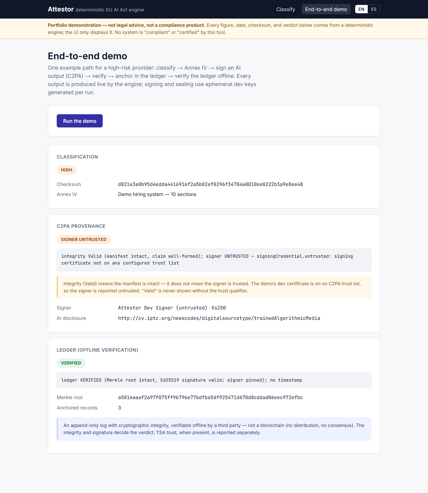
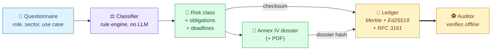
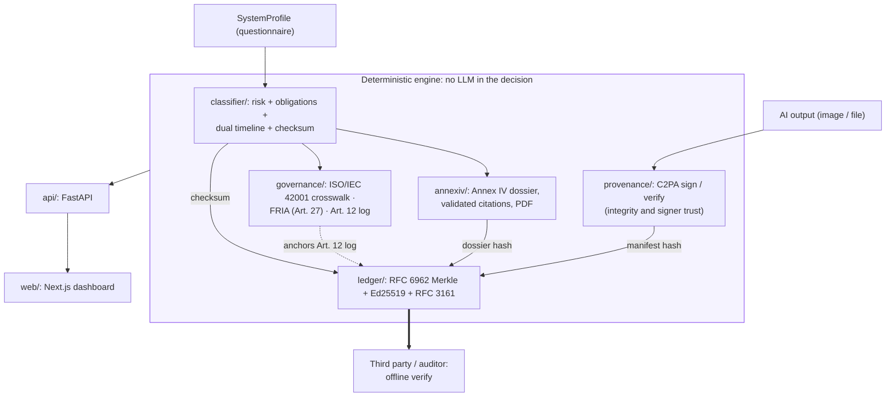
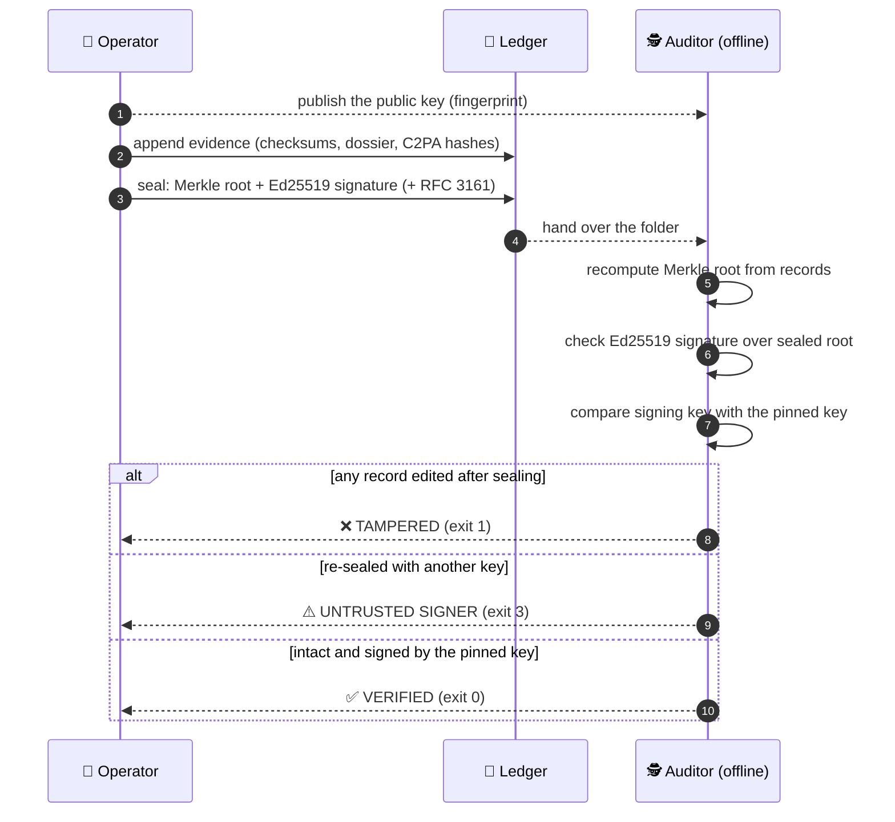
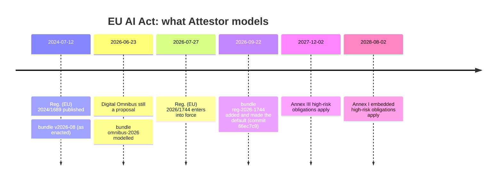

<div align="center">

# 🛡️ Attestor

### EU AI Act risk classification and compliance evidence, verifiable by anyone.

**Describe an AI system → get its legal risk class, its obligations and their deadlines, a
ready-to-complete Annex IV technical dossier, and a cryptographic receipt anyone can verify offline.**

🇬🇧 **English** · [🇪🇸 Español](README.es.md)

[](https://github.com/marcosmatalab/attestor/actions/workflows/ci.yml)
[](https://github.com/marcosmatalab/attestor/releases)
[](pyproject.toml)
[](LICENSE)


</div>

---

## ⚡ In 30 seconds

| | |
|---|---|
| 🎯 **The problem** | The EU AI Act classifies AI systems by risk, and each class carries obligations with their own legal deadlines. Companies must prove what they decided, when, and on what legal basis. |
| 🧠 **What Attestor does** | A **rule engine** (no LLM) turns a short questionnaire into a risk class, the list of obligations that apply and the date each one binds, plus the **Annex IV technical dossier** (the documentation the Act requires) as a PDF, with every legal citation checked. |
| 🔐 **Why it can be trusted** | Every result carries a **reproducible checksum** that can be sealed in a **cryptographic ledger** (Ed25519-signed Merkle tree, optional RFC 3161 timestamp). An auditor verifies it **offline**, with one command. |
| 🖼️ **Plus** | Signs AI-generated content with **C2PA Content Credentials** (the machine-readable marking of Art. 50(2)) and maps the result to **ISO/IEC 42001**, the **Fundamental Rights Impact Assessment** (FRIA, Art. 27) and **Art. 12** logging. |
| 👥 **Who it's for** | Teams that **build** AI systems (providers), organisations that **use** them (deployers such as banks, insurers or public bodies), and the **auditors** who have to check both. |

<div align="center">



<sub>A real screenshot of the running app. The checksum in it is the one <code>attestor classify</code>
reproduces today, and a test fails CI if it ever drifts.</sub>

</div>

## 💡 In plain words

Think of Attestor as **a tax calculator for AI regulation that also prints a signed, tamper-evident receipt**.

You answer a few questions about your AI system: are you building it or using it, what is it
used for, does it talk to people, does it generate images or text. Attestor tells you, with
the article of the law behind every obligation:

- 🚦 **how risky the law considers it,**
- 📋 **what you are required to do,**
- 📅 **by which date,**
- 🧾 and gives you **signed proof** of that answer and of the version of the law it used. If a
  sealed record is edited, verification against your published key fails. Add an RFC 3161
  timestamp and it also proves *when*.

**Real outputs of the engine**, under the law in force (`reg-2026-1744`):

| Scenario | Risk | What Attestor reports | From |
|---|:---:|---|:---:|
| 🧑‍💼 A company sells an AI tool that screens CVs | 🟠 **High** | **13 obligations**: risk management, data governance, logging, human oversight, CE marking… (Art. 9–17, 43, 47–49) | 2 Dec 2027 |
| 🏦 A bank uses an AI credit-scoring system | 🟠 **High** | **2 obligations**: log retention (Art. 26(6)) and a fundamental rights impact assessment (Art. 27) | 2 Dec 2027 |
| 💬 A customer-service chatbot | 🟡 **Limited** | **1 obligation**: tell users they are talking to an AI (Art. 50(1)) | 2 Aug 2026 |
| 🗂️ An internal tool with none of the above | 🟢 **Minimal** | No specific obligations | — |

<details>
<summary>▶️ Reproduce each row</summary>

```bash
attestor classify --role provider --annex-iii-area employment      # CV screening
attestor classify --role deployer --annex-iii-area credit_scoring  # bank, credit scoring
attestor classify --role provider --interacts-with-humans          # chatbot
attestor classify --role provider                                  # internal tool
```

</details>

> [!NOTE]
> The CV screener under the law **as originally enacted** (`--bundle v2026-08`) has the same
> 13 obligations, due **2 Aug 2026**. The Digital Omnibus moved them 16 months later.
> Attestor keeps every version of the law it has modelled and can answer under any of them,
> so the change itself is visible and reproducible.

## 📊 At a glance

<div align="center">

| ✅ Python tests | 📈 Coverage | 🧪 Frontend tests | 🔎 Type errors | 🧹 Dead code | ⚓ Anchored digests |
|:---:|:---:|:---:|:---:|:---:|:---:|
| **511** passing | **97%** (CI gate: 95%) | **20** passing | **0** · mypy strict | **0** findings | **27** literal SHA-256 |

| 🤖 LLMs in the decision | 🌐 Network calls during verification | 📜 Regulatory scenarios | 🔁 Same input, same output |
|:---:|:---:|:---:|:---:|
| **0** · enforced by an automated test | **0** · enforced by an automated test | **3** bundles (2 historical · 1 in force), all hash-anchored | **Identical** checksum on every run |

</div>

Every number above is reproducible with a command listed in
[Engineering quality](#engineering-quality) or [Every claim has a command](#every-claim-has-a-command),
and CI re-runs the test and quality gates on every push.

## 🧭 How it works



1. **Classify.** Answers go through versioned YAML rules. The result is a risk tier
   (🔴 prohibited · 🟠 high · 🟡 limited · 🟢 minimal), each obligation with its own
   effective date, and a SHA-256 checksum of the canonical decision.
2. **Document.** High-risk providers get the Annex IV dossier. Every legal citation in it
   is validated against the bundle, and the PDF renders **deterministically** (reportlab invariant mode, checked byte for byte in tests).
3. **Seal.** Records carrying the checksum, the dossier hash and the C2PA manifest hash
   become leaves of an RFC 6962 Merkle tree. The root is signed with Ed25519 and can carry
   an RFC 3161 timestamp.
4. **Verify.** Anyone with the ledger folder and the operator's public key runs
   `attestor ledger verify --public-key`, with no private key and no network, and gets an
   exit code: `0` intact, `1` tampered, `3` sealed by someone else, `4` no key pinned.

<details>
<summary><b>🏛️ Full module architecture</b></summary>

<br/>

Each box inside the engine is a real package in [`src/attestor/`](src/attestor). The HTTP and UI layers only
display what the engine produces, and a test checks that the engine never imports them.



</details>

## 🤔 Why it's built this way

When a regulator or an auditor examines an AI system, they ask three questions. Each part of
Attestor exists to answer one of them **with proof rather than a promise**:

| The question | Attestor's answer | How |
|---|---|---|
| ❓ *What did you decide, and why?* | A risk class and a list of obligations, each citing its article | A rule engine over versioned YAML rules that a lawyer can review rule by rule |
| ❓ *Under which version of the law?* | Every result names its regulatory bundle and that bundle's SHA-256 | Bundles are frozen; a change in the law is a new file, never an edit |
| ❓ *Can you prove it wasn't changed later?* | A signed ledger that anyone verifies offline against the operator's published public key | Ed25519 + RFC 6962 Merkle tree + RFC 3161, with a `0`/`1`/`3`/`4` exit code |

**Why not just ask an LLM?** Because a compliance answer is **evidence**, and evidence has to
come out identical when someone else recomputes it months later. A language model cannot
guarantee that; a rule engine with a checksum can. The engine contains no LLM, and a test
fails CI if an LLM SDK is ever imported into it.

## 🚀 Try it in 60 seconds

Installed from the tagged release (nothing is published to a package index). No private
key, no configuration, and no network after install:

```bash
git clone --branch v0.2.0 https://github.com/marcosmatalab/attestor.git && cd attestor
pip install -e .

# 1️⃣  Verify the committed ledger offline, pinned to the key that signed it
attestor ledger verify examples/ledger --public-key examples/ledger/public_key.pem
# ledger VERIFIED (Merkle root intact, Ed25519 signature valid; signer pinned) … -> exit 0

# 2️⃣  Change one byte of evidence and watch the verdict flip
sed -i 's/sys-1/sys-9/' examples/ledger/records.json      # macOS: sed -i ''
attestor ledger verify examples/ledger --public-key examples/ledger/public_key.pem
# ledger TAMPERED - integrity_ok=False, signature_ok=True         -> exit 1
git checkout examples/ledger/records.json

# 3️⃣  Reproduce a classification checksum, under two versions of the law
attestor classify --role provider --annex-iii-area employment --checksum-only
# d821e3e0b95d4edda4416916f2a5b02ef0296f34704a0010ee0222b3a9e0ee48   (law in force)
attestor classify --role provider --annex-iii-area employment --bundle v2026-08 --checksum-only
# 15815cd8f577dea7cc09696acc9a3e96870664573ea428e7c81bb8b06a84bd17   (as enacted)

# 4️⃣  The whole pipeline, end to end
attestor demo
```

> [!TIP]
> In step 2, `integrity_ok` goes false while `signature_ok` stays true. The ledger tells
> **"the evidence was changed after sealing"** apart from **"the signature does not match the root"**:
> two different failures, reported separately. Re-sealing edited records with another key
> gets past both, and that is what the pin catches: `UNTRUSTED SIGNER`, exit `3`. Run without
> a key and the answer is `SIGNER NOT PINNED`, exit `4`: no `0` without naming the signer.
> The key's fingerprint is `21ffc076…5544`; [`examples/ledger/`](examples/ledger) explains the pin.



<a id="every-claim-has-a-command"></a>

## ✅ Every claim has a command

| Claim | Command | Expected result |
|---|---|---|
| 🔁 The decision is deterministic | `attestor classify --role provider --annex-iii-area employment --checksum-only`, twice | Same checksum `d821e3e0…ee48` both times |
| 🤖 No LLM anywhere in the decision | `pytest tests/test_architecture.py -k llm` | Walks the AST of every engine module; an LLM SDK import fails the build |
| 🧱 The engine never imports the API layer | `pytest tests/test_architecture.py -k api_layer` | Dependencies point one way, checked by a test |
| 📜 The law in force left the earlier bundles untouched | `pytest tests/test_regulatory_evolution.py` | Both historical bundles still hash to their June 2026 values |
| ⚓ Checksums are anchored to literal digests | `pytest tests/test_checksum_anchors.py` | 27 committed SHA-256 values |
| 🖼️ The screenshot matches the engine today | `pytest tests/test_dashboard_capture.py` | The checksum stamped into the PNG equals a live `classify()` |
| 🧰 Every tool the gates run is declared | `pytest tests/test_tooling_declared.py` | Parses the Makefile against the `dev` extra |
| 🕵️ A third party verifies the ledger offline | `attestor ledger verify examples/ledger --public-key examples/ledger/public_key.pem` | `ledger VERIFIED …; signer pinned`, exit 0, no network |
| 🚨 Tampering is detected | flip a byte in `examples/ledger/records.json`, re-run | `ledger TAMPERED …`, exit 1 |
| 🔏 A ledger re-sealed with another key is caught | `pytest tests/test_ledger_signer_pinning.py` | Edit, re-seal with a fresh key, pin the original: `UNTRUSTED SIGNER`, exit 3 |
| 🔑 No exit 0 without a pinned signer | `attestor ledger verify examples/ledger` | `SIGNER NOT PINNED`, exit 4 (`--allow-unpinned` opts back into 0) |
| 🪪 Integrity and trust are reported separately | `attestor demo` | `integrity Valid …; signer UNTRUSTED …` (the demo certificate is correctly flagged as not on a trust list) |
| 🌐 The full suite runs with no network | `python scripts/run_offline.py` | 511 passed, every outbound connection refused |

Each of these gates was proven by breaking it on purpose: `import httpx` in the classifier
fails the architecture test, one edited date fails nine checksum anchors, one line removed
from the `dev` extra fails the tooling test, and editing the screenshot's sidecar fails the
capture test.

## 📅 The law changed. The earlier versions didn't have to.



| Bundle | What it is | Status |
|---|---|---|
| `v2026-08` | Reg. (EU) 2024/1689 as originally enacted (named after its 2 Aug 2026 application date) | 🧊 Frozen, historical |
| `omnibus-2026` | The Digital Omnibus as modelled on 23 June 2026, while still a proposal | 🧊 Frozen, historical |
| `reg-2026-1744` | Reg. 2024/1689 as amended by Reg. 2026/1744 | 🟢 **In force, and the default** |

The amendment was modelled while it was still a proposal. When it became law the model
matched. The repository absorbed it on **22 Sep 2026** (commit `66ec7c9`): a new bundle file,
the default moved from `v2026-08` to it in the engine and the API, and three small engine
edits in the same commit: the timeline now compares against the bundle in force, and the
Annex IV field `provisional_note` became `status_note` (its one golden file followed).
No rule was migrated, and the two earlier bundles and their classification golden vectors
did not change by a byte.

That was designed, not lucky. Effective dates live **on each obligation**, never as one
global date, so an amendment that moves some deadlines and not others is additive by
construction. Full history in [`docs/regulatory-changelog.md`](docs/regulatory-changelog.md).

## ⚖️ Trade-offs, chosen on purpose

Every design gives something up. These are the main trade-offs, and why each one is the right
call for an evidence system:

| Choice | What it buys | What it costs | Why it's worth it |
|---|---|---|---|
| **Rule engine** instead of an LLM | Reproducible, auditable decisions | Legal interpretations are written by hand in YAML; input is a structured questionnaire | An answer that can't be recomputed identically is not evidence |
| **Signed append-only log** instead of a blockchain | No infrastructure, no fees, one-command offline verification | One operator signs, so auditors check its key against the one it published; proof of *when* comes from RFC 3161 | An auditor needs a file to check, not a network to join |
| **Frozen bundles** instead of editing rules | Every past answer stays exactly reproducible | A change in the law is a new bundle file, with some duplication | Editing a rule in place would make sealed answers impossible to reproduce |
| **Deadlines per obligation** instead of one global date | Amendments that move only some dates are purely additive | More verbose bundles | This is what let the Omnibus land without migrating a rule or an earlier bundle |
| **Network only when signing or sealing**, never when verifying | Anyone verifies, anywhere, offline | An RFC 3161 timestamp (ledger root or C2PA manifest) needs a call to a timestamping authority | Verification is what third parties run; signing stays on the operator's side |
| **Integrity and signer trust** reported separately | An unknown signer is never mistaken for tampering | Two verdicts to read instead of one boolean | Merging them causes false alarms or false confidence |
| **Default-valued fields left out** of the canonical form | New questionnaire fields don't change older checksums | A new field whose default carries meaning needs a new bundle | Old evidence keeps verifying as the questionnaire grows |

<a id="engineering-quality"></a>

## 🏗️ Engineering quality

| | Measured | Command |
|---|---|---|
| 🧪 Python tests | **511 passed** | `pytest` |
| 📈 Coverage | **97%** of 1,254 statements, CI gate at 95% | `make test` |
| ⚛️ Frontend tests | **20 passed** in 7 files | `cd web && npm test` |
| 🔎 Types | mypy **strict, 0 errors** across 38 modules | `mypy src/attestor` |
| 🧹 Dead code | **0 findings** | `vulture src tests --min-confidence 80` |
| ✨ Lint and format | clean, `ruff` pinned exactly | `ruff check . && ruff format --check .` |

CI runs `make check`, so the workflow and the Makefile cannot drift apart, plus the
frontend's ESLint, build, `tsc` and Vitest, all blocking. Python tools are pinned to exact
versions, the frontend is locked by `package-lock.json`, and GitHub Actions are pinned to
commit SHAs.

## 💻 Run it locally

```bash
python -m venv .venv && source .venv/bin/activate   # Windows: .venv\Scripts\activate
pip install -e ".[dev]"

attestor demo                             # the whole pipeline, no keys, no network
uvicorn attestor.api.main:app --reload    # API at http://127.0.0.1:8000
make check                                # every Python gate CI runs, in CI's order
```

The dashboard is a Next.js app over the same API, in English and Spanish:

```bash
cd web && npm install && npm run dev      # http://localhost:3000
make web                                  # lint, build, typecheck, vitest
```

Configuration comes from the environment or a local `.env`; see
[`.env.example`](.env.example).

## 🛠️ Stack

| Layer | Technology |
|---|---|
| ⚖️ Classifier and Annex IV | Deterministic Python rule engine over versioned YAML bundles; citations validated against the bundle |
| 🖼️ Content provenance | `c2pa-python` (`Builder`, `Reader`), signing through a pluggable `Signer.from_callback` interface |
| 🔗 Ledger and timestamps | Ed25519 and an RFC 6962 Merkle tree (`cryptography`), RFC 3161 tokens (`rfc3161-client`) |
| 🏛️ Governance | ISO/IEC 42001 crosswalk, FRIA (Art. 27) scaffold, Art. 12 logs |
| 🌐 API and frontend | FastAPI; Next.js 16 (App Router, React 19), bilingual EN/ES |
| 📄 PDF | reportlab in invariant mode, byte-identical output |

<a id="documentation"></a>

## 📚 Documentation

| Document | What it covers |
|---|---|
| [`docs/classifier.md`](docs/classifier.md) | The rule engine and the bundle schema |
| [`docs/timeline.md`](docs/timeline.md) · [`docs/regulatory-changelog.md`](docs/regulatory-changelog.md) | Comparing timelines; how the law changed and how the bundles absorbed it |
| [`docs/annex-iv.md`](docs/annex-iv.md) | The Annex IV dossier and citation validation |
| [`docs/provenance.md`](docs/provenance.md) | C2PA signing and verification |
| [`docs/ledger.md`](docs/ledger.md) | Merkle, Ed25519, RFC 3161, and what each one proves |
| [`docs/governance.md`](docs/governance.md) | ISO/IEC 42001 crosswalk, FRIA, Art. 12 logs |
| [`docs/api.md`](docs/api.md) · [`docs/roadmap.md`](docs/roadmap.md) | The endpoints and the dashboard; what each build phase delivered |
| [`docs/README.md`](docs/README.md) | Docs index, and how the screenshot is kept in sync with the engine |
| [`CHANGELOG.md`](CHANGELOG.md) | Releases, and separately the dates the law itself moved |

📌 Scope, legal notice and design boundaries are in [`docs/scope.md`](docs/scope.md).

## 📄 License

[MIT](LICENSE) © 2026 Marcos Mata García
