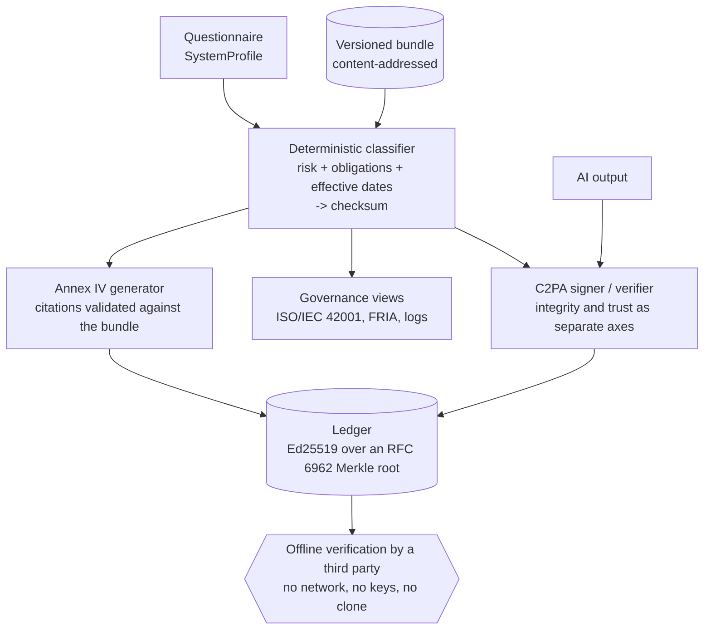

# Attestor

[](https://github.com/marcosmatalab/attestor/actions/workflows/ci.yml)
[](https://github.com/marcosmatalab/attestor/releases)
[](LICENSE)

**Attestor classifies an AI system under Regulation (EU) 2024/1689 with a
deterministic rule engine, not an LLM. The same input always yields the same output
and the same checksum, and every artifact is anchored in a cryptographic ledger that
a third party can verify with no network, no keys and no clone.**

---

## Verify it in 60 seconds

No keys, no network, no guessing. From a clean clone:

```bash
pip install -e .

# 1. Verify the committed ledger offline
attestor ledger verify examples/ledger
# ledger VERIFIED (Merkle root intact, Ed25519 signature valid)   -> exit 0

# 2. Tamper with one byte and the verdict flips
sed -i 's/sys-1/sys-9/' examples/ledger/records.json
attestor ledger verify examples/ledger
# ledger TAMPERED - integrity_ok=False, signature_ok=True         -> exit 1
git checkout examples/ledger/records.json

# 3. Reproduce a classification checksum, under either timeline
attestor classify --role provider --annex-iii-area employment --checksum-only
# d821e3e0b95d4edda4416916f2a5b02ef0296f34704a0010ee0222b3a9e0ee48   (law in force)
attestor classify --role provider --annex-iii-area employment --bundle v2026-08 --checksum-only
# 15815cd8f577dea7cc09696acc9a3e96870664573ea428e7c81bb8b06a84bd17   (as enacted)

attestor demo                                   # 4. the whole pipeline, end to end
```

Step 2 is the one worth pausing on: `integrity_ok` goes false while `signature_ok`
stays true. The signature covers the sealed Merkle root, so an edited record says
*the evidence was changed after sealing*, a different accusation from *the signature
is wrong*.

---

## What it does

1. **Classifies risk and resolves dates.** A rule engine over a versioned bundle
   decides the tier and which obligations apply **from which date**, with a
   content-addressed checksum an auditor can reproduce.
2. **Generates the Annex IV dossier.** A citation that does not resolve, or does not
   trace to an obligation the classifier emitted, is rejected rather than rendered.
3. **Signs outputs with C2PA.** Integrity and signer trust are reported as two
   separate axes, so an unrecognised signer never looks like a tampered file.
4. **Anchors everything in a ledger.** Ed25519 over an RFC 6962 Merkle root,
   verifiable offline by someone with neither the keys nor the repository.

---

## Every claim, and the command that proves it

| Claim | Command | Expected result |
|---|---|---|
| The decision is deterministic | `attestor classify --role provider --annex-iii-area employment --checksum-only`, twice | The same checksum `d821e3e0...ee48` both times |
| No LLM touches the decision | `pytest tests/test_architecture.py` | Passes. It walks the AST of all 38 engine modules and forbids LLM SDKs, `httpx`, `requests` and `socket` |
| The engine never depends on the API layer | `pytest tests/test_architecture.py` | The same test asserts that no engine package imports `attestor.api` |
| Adopting the Omnibus changed no golden vector | `pytest tests/test_regulatory_evolution.py` | Passes: both historical bundles still hash to their June 2026 values |
| The checksum is anchored, not just self-consistent | `pytest tests/test_checksum_anchors.py` | Passes against 27 committed literal digests |
| A third party verifies the ledger offline | `attestor ledger verify examples/ledger` | `ledger VERIFIED ...`, exit 0, with no network |
| Tampering is detected | flip a byte in `examples/ledger/records.json`, re-run | `ledger TAMPERED ...`, exit 1 |
| An untrusted signer is never reported as trusted | `attestor demo` | The C2PA line reads `integrity Valid ...; signer UNTRUSTED ...` |
| Coverage is 97%, and the run fails below 95% | `pytest` | `TOTAL 1166 39 97%` |
| No dead code | `vulture src tests --min-confidence 80` | No output |
| Types are checked in strict mode | `mypy src/attestor` | `Success: no issues found in 38 source files` |
| The whole suite runs with no network | `pytest` with the network off | 356 passed |

The two gates that could have been decorative were verified by breaking them on
purpose: appending `import httpx` to the classifier fails the architecture test, and
editing one date in a bundle fails the checksum anchors.

---

## Regulatory timeline: what changed, and when

The Digital Omnibus on AI is **in force**: Reg. (EU) 2026/1744, adopted 29 June 2026,
binding since **27 July 2026**. It moves Annex III high-risk to **2 Dec 2027** and
Annex I embedded to **2 Aug 2028**. Attestor ships three bundles and shows both
timelines, because knowing what changed is part of the answer:

| Bundle | What it is | Status |
|---|---|---|
| `v2026-08` | Reg. (EU) 2024/1689 as originally enacted | Frozen, historical |
| `omnibus-2026` | The Omnibus as modelled on 23 June 2026, while still a proposal | Frozen, historical |
| `reg-2026-1744` | Reg. 2024/1689 as amended by Reg. 2026/1744 | **In force, and the default** |

**The part worth reading.** Those deltas were modelled while the text was still a
proposal. When it became law all four matched, and absorbing it cost **one new bundle
file and one changed default**: no engine change, no migration, no rewritten golden
vector. That is a schema decision rather than luck - effective dates live **on each
obligation**, never as one global date, so an amendment that moves some dates and not
others is additive by construction.
Full history: [`docs/regulatory-changelog.md`](docs/regulatory-changelog.md).

---

## Architecture



The arrows only point one way: no engine package imports the API layer, and `tests/test_architecture.py` enforces it.

---

## Run it locally

```bash
python -m venv .venv && source .venv/bin/activate   # Windows: .venv\Scripts\activate
pip install -e ".[dev]"

attestor demo                       # the whole pipeline, no keys, no network
uvicorn attestor.api.main:app --reload
curl -s -XPOST localhost:8000/api/demo/run | jq .provenance.headline

make check                          # every gate CI runs, in the order CI runs it
```

The dashboard is a Next.js app over the same API:

```bash
cd web && npm ci && npm run dev     # expects the API on http://127.0.0.1:8000
make web                            # lint, typecheck, build, vitest
```

---

## Engineering

Every figure below has the command that produces it next to it. None of them is
typed into a badge.

| | Measured | Command |
|---|---|---|
| Python tests | **356 passed** | `pytest` |
| Coverage | **97%**, 1166 statements, 39 missed, gate at 95% | `pytest` |
| Frontend tests | **21 passed** in 5 files | `cd web && npm test` |
| Types | strict, **0 errors** across 38 modules | `mypy src/attestor` |
| Dead code | **0 findings** | `vulture src tests --min-confidence 80` |
| Lint and format | clean, pinned to `ruff==0.16.8` | `ruff check . && ruff format --check .` |

CI gates, all blocking: ruff lint, ruff format (which covers the Python blocks
*inside* this file), mypy strict, vulture, pytest with the coverage floor, and the
frontend's eslint, tsc, build and vitest. Tool versions are pinned exactly and the
GitHub Actions are pinned to commit SHAs. A range is what broke this CI once already:
ruff 0.16 began formatting Markdown code blocks and the format gate went red with
nobody touching the repository.

---

## Deeper docs

| Document | What it covers |
|---|---|
| [`docs/classifier.md`](docs/classifier.md) | The rule engine, the bundle schema, and the deliberate simplifications |
| [`docs/timeline.md`](docs/timeline.md) | Comparing one profile across scenarios |
| [`docs/regulatory-changelog.md`](docs/regulatory-changelog.md) | How the law changed, and how the bundles absorbed it |
| [`docs/annex-iv.md`](docs/annex-iv.md) | The dossier, and what a validated citation does and does not mean |
| [`docs/provenance.md`](docs/provenance.md) | C2PA signing, the KMS seam, and the integrity/trust split |
| [`docs/ledger.md`](docs/ledger.md) | Merkle, Ed25519, RFC3161, and what each one proves |
| [`docs/governance.md`](docs/governance.md) | ISO/IEC 42001 mapping, FRIA, record-keeping |
| [`docs/api.md`](docs/api.md) | The eight endpoints and the dashboard |
| [`docs/roadmap.md`](docs/roadmap.md) | What each build phase delivered |

---

## Stack

| Layer | Technology |
|-------|------------|
| Classifier | Python deterministic rule engine (no LLM in the decision), versioned YAML/JSON bundle |
| Annex IV | Deterministic template derived from the classification, no LLM. Citations validated against the bundle |
| C2PA | `c2pa-python` (`Builder` to sign, `Reader` to verify) |
| C2PA keys | Local PEM chain + key, read from config. `Signer.from_callback` is the seam a KMS/HSM signer would plug into; no KMS backend ships here |
| Timestamp | RFC3161 codec (request + token parsing). The token is verified to *bind* to the signed root; TSA chain validation is out of scope |
| Ledger | Ed25519 (`cryptography`) + custom Merkle tree + RFC3161 |
| Backend | FastAPI. No database: nothing in the engine persists state |
| Frontend | Next.js (registration, compliance dashboard, verifier) |
| PDF | Annex IV dossier + evidence export |

---

## What this is not

A **portfolio project**, built to demonstrate engineering across AI governance,
cryptography and compliance. These limits are the specification, not an apology:

- **Not legal advice.** Compliance *support and evidence*, for human review. The
  interpretation lives in a versioned bundle, never hardcoded.
- **C2PA proves provenance, not truth.** A valid credential shows the manifest is
  intact and says who signed it; it does not assert the content is accurate, and the
  **absence** of one does not mean content was AI-generated.
- **The shipped certificates are untrusted on purpose** - self-signed dev material,
  so the repo runs with no keys, and the verifier says so rather than pretending.
- **RFC3161 tokens are verified as *bound*, not *trusted*:** the `messageImprint` is
  checked against the signed root, but the TSA's CMS signature and chain are not,
  which a full AdES "T" level would require.
- **No Art. 6(3) derogation.** Every Annex III system is treated as high-risk; the
  rules are precedence-ordered so the filter slots in above `high_annex_iii`. Arts
  18/19/20 are likewise not modelled, and the bundle covers a representative subset
  of high-risk obligations rather than the exhaustive list.
- **The ISO/IEC 42001 map is a defensible structuring, not a normative mapping,** as
  is the obligation-to-Annex-IV-section placement. Every entry carries its rationale.
- **No database, no multi-tenancy, no KMS backend.** Nothing here persists state.

---

## Provenance

Built in short intense bursts rather than at a steady cadence, one pull request per
phase. **I used AI assistance to write code and documentation.** The design decisions
are mine, and they are the ones I would defend in an interview: storing effective
dates **per obligation** rather than as one global date, which is why the Omnibus
becoming law was absorbed by adding a bundle instead of rewriting the engine; keeping
**integrity and trust as two separate axes** in C2PA, RFC3161 and the ledger, so an
unrecognised signer never looks like a tampered file; excluding default-valued fields
from the canonical form, so adding questionnaire questions does not change the
checksum of older inputs; and keeping the RFC3161 module a **pure codec that does no
I/O**, so "the engine opens no socket" is an invariant a test enforces rather than a
claim in a README.

The engine calls no LLM, and `tests/test_architecture.py` enforces it.

---

## License

[MIT](LICENSE) (c) 2026 Marcos Mata Garcia
