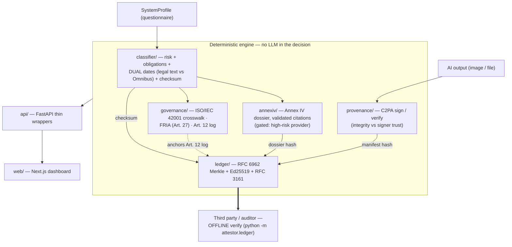

# Attestor

[](https://github.com/marcosmatalab/attestor/actions/workflows/ci.yml)
[](https://github.com/marcosmatalab/attestor/releases)


**A deterministic EU AI Act compliance engine: the classification decision is a rule
engine, NOT an LLM, so the same input always yields the same output with a reproducible
checksum — and everything is anchored in a cryptographic ledger a third party can verify
offline.**


> The checksum in this screenshot is the one the command below reproduces, and
> `tests/test_dashboard_capture.py` fails if it ever stops being true. Portfolio
> demonstration, not legal advice: every value shown is produced by the deterministic
> engine, never asserted by the UI.

## Verify it in 60 seconds

No keys, no network, no guessing. From a clean clone:

```bash
pip install -e .

# 1. Verify the committed ledger offline
attestor ledger verify examples/ledger
# ledger VERIFIED (Merkle root intact, Ed25519 signature valid)   -> exit 0

# 2. Tamper with one byte and the verdict flips
sed -i 's/sys-1/sys-9/' examples/ledger/records.json
attestor ledger verify examples/ledger
# ledger TAMPERED - integrity_ok=False, signature_ok=True         -> exit 1
git checkout examples/ledger/records.json

# 3. Reproduce a classification checksum, under either timeline
attestor classify --role provider --annex-iii-area employment --checksum-only
# d821e3e0b95d4edda4416916f2a5b02ef0296f34704a0010ee0222b3a9e0ee48   (law in force)
attestor classify --role provider --annex-iii-area employment --bundle v2026-08 --checksum-only
# 15815cd8f577dea7cc09696acc9a3e96870664573ea428e7c81bb8b06a84bd17   (as enacted)

attestor demo                                   # 4. the whole pipeline, end to end
```

Step 2 is the one worth pausing on: `integrity_ok` goes false while `signature_ok` stays
true. The signature covers the sealed root, so an edited record says *the evidence was
changed after sealing* — a different accusation from *the signature is wrong*.

## What it does

You describe an AI system and Attestor **classifies its risk** under the EU AI Act
(prohibited / high / limited / minimal), resolves **which obligations apply and from which
date**, generates the **Annex IV technical dossier** with citations validated against a
versioned regulatory bundle, signs AI outputs with **C2PA Content Credentials** (Art. 50),
and **anchors every artifact in a cryptographic ledger** (Ed25519 + RFC 6962 Merkle +
RFC 3161) that a third party can verify offline.

One caveat belongs up here rather than in a footnote: **sealing a root may reach the
network**, because an RFC 3161 timestamp has to be fetched from a timestamping authority.
**Verification never does** — enforced, not promised: `tests/test_architecture.py` confines
network imports to `ledger/timestamp.py` and asserts that no verifier imports a network
client. So `grep urllib src/` finds one hit, in the one place a timestamp cannot avoid it.

## Every claim, and the command that proves it

Every property this repository is sold on is a row, with the command that checks it.

| Claim | Command | Expected result |
|---|---|---|
| The decision is deterministic | `attestor classify --role provider --annex-iii-area employment --checksum-only`, twice | The same checksum `d821e3e0…ee48` both times |
| No LLM anywhere in the decision | `pytest tests/test_architecture.py -k llm` | Walks the AST of every engine module; an LLM SDK import fails the build |
| The engine never imports the API layer | `pytest tests/test_architecture.py -k api_layer` | The arrow points one way, checked rather than drawn |
| Absorbing the Regulation changed no golden vector | `pytest tests/test_regulatory_evolution.py` | Both historical bundles still hash to their June 2026 values |
| Checksums are anchored to literal digests | `pytest tests/test_checksum_anchors.py` | 27 committed digests, not a run compared against itself |
| The screenshot shows what the engine produces today | `pytest tests/test_dashboard_capture.py` | The checksum stamped into the PNG equals a live `classify()` |
| The tools the gates run are declared | `pytest tests/test_tooling_declared.py` | Parses the Makefile; an undeclared tool is exit 127 on a clean runner |
| A third party verifies the ledger offline | `attestor ledger verify examples/ledger` | `ledger VERIFIED …`, exit 0, with no network |
| Tampering is detected | flip a byte in `examples/ledger/records.json`, re-run | `ledger TAMPERED …`, exit 1 |
| An untrusted signer is never reported as trusted | `attestor demo` | `integrity Valid …; signer UNTRUSTED …` — never `Valid` alone |
| The whole suite runs with no network | `python scripts/run_offline.py` | 417 passed, every outbound connection refused |

Every gate that could have been decorative was verified by breaking it on purpose:
`import httpx` in the classifier fails the architecture test, one edited date fails nine
checksum anchors, one line removed from the dev extra fails the tooling test, and editing
the screenshot's sidecar fails the capture test.

## Regulatory timeline: what changed, and when

The Digital Omnibus on AI is **in force**: Reg. (EU) 2026/1744, adopted 29 June 2026,
published in the OJEU on 24 July and binding since **27 July 2026**. It moves Annex III
high-risk obligations to **2 Dec 2027** and Annex I embedded systems to **2 Aug 2028**.
Attestor ships three bundles and shows both timelines, because what changed is part of the
answer:

| Bundle | What it is | Status |
|---|---|---|
| `v2026-08` | Reg. (EU) 2024/1689 as originally enacted | Frozen, historical |
| `omnibus-2026` | The Omnibus as modelled on 23 June 2026, while still a proposal | Frozen, historical |
| `reg-2026-1744` | Reg. 2024/1689 as amended by Reg. 2026/1744 | **In force, and the default** |

**The part worth reading.** Those deltas were modelled while the text was still a proposal.
When it became law they matched, and absorbing it cost **one bundle file and one changed
default**: no engine change, no migration, no rewritten golden vector. That is a schema
decision rather than luck — effective dates live **on each obligation**, never as one global
date, so an amendment moving some dates and not others is additive by construction. Full
history: [`docs/regulatory-changelog.md`](docs/regulatory-changelog.md).

## Architecture

Each node is a module that exists in the repo. The classification decision is a rule engine
(no LLM); the HTTP/UI layer is a thin wrapper that only displays engine output.



## Run it locally

```bash
python -m venv .venv && source .venv/bin/activate   # Windows: .venv\Scripts\activate
pip install -e ".[dev]"

attestor demo                             # the whole pipeline, no keys, no network
uvicorn attestor.api.main:app --reload    # http://127.0.0.1:8000
make check                                # every gate CI runs, in CI's order
```

The dashboard is a Next.js app over the same API:

```bash
cd web && npm install && npm run dev      # http://localhost:3000
make web                                  # lint, build, typecheck, vitest
```

It calls `http://127.0.0.1:8000` by default; `NEXT_PUBLIC_API_BASE_URL` points it elsewhere
and `CORS_ORIGINS` tells the backend which origins to accept. Config comes from the
environment or a local `.env` — see [`.env.example`](.env.example), where every variable is
one the code actually reads.

## Engineering

Every figure has the command that produces it next to it. None is typed into a badge,
because a badge is a number nothing re-checks.

| | Measured | Command |
|---|---|---|
| Python tests | **417 passed** | `pytest` |
| Coverage | **97%**, 1178 statements, 35 missed, gate at 95% | `pytest` |
| Frontend tests | **20 passed** in 7 files | `cd web && npm test` |
| Types | strict, **0 errors** across 36 modules | `mypy src/attestor` |
| Dead code | **0 findings** | `vulture src tests --min-confidence 80` |
| Lint and format | clean, pinned to `ruff==0.16.8` | `ruff check . && ruff format --check .` |

CI runs these through `make check`, so the Makefile and the workflow cannot drift, plus the
frontend's eslint, build, tsc and vitest — all blocking. Tools are pinned exactly and the
Actions to commit SHAs: a range is what broke this CI once already, when ruff 0.16 began
formatting Markdown code blocks and the gate went red on its own.

## What this is not

A **portfolio project**, built to demonstrate engineering across AI governance, cryptography
and compliance. These limits are the specification, not an apology:

- **Not legal advice.** Compliance *support and evidence*, for human review. The
  interpretation lives in a versioned bundle, never hardcoded.
- **C2PA proves provenance, not truth.** A valid credential shows the manifest is intact and
  identifies the signer — **integrity is not trust**, a `"Valid"` state says nothing about
  whether the signer is recognised, and neither asserts the content is accurate. The
  **absence** of a credential does not mean content was AI-generated.
- **The ledger is an append-only log, not a blockchain.** Offline-verifiable integrity
  and existence proofs, but not distributed and with no consensus: the operator holds the
  key and can still rewrite history that is not yet signed and timestamped.
- **RFC 3161 tokens are checked, TSA trust is not granted.** No recognised-authority list
  ships, so a cryptographically valid token from a free TSA is reported untrusted. It never
  changes the tamper verdict or the exit code.
- **Governance artifacts help; they do not certify.** The ISO/IEC 42001 mapping is a
  reference crosswalk (IDs, no normative text), the FRIA is a scaffold for the deployer to
  complete, and the Art. 12 log is a capability — necessary, not sufficient, for conformity.
- **No KMS backend, and no database.** The signing seam exists; the integration does not.
  Nothing in the engine persists state.

## Deeper docs

| Document | What it covers |
|---|---|
| [`docs/classifier.md`](docs/classifier.md) | The rule engine, the bundle schema, the deliberate simplifications |
| [`docs/timeline.md`](docs/timeline.md), [`docs/regulatory-changelog.md`](docs/regulatory-changelog.md) | Comparing scenarios; how the law changed and how the bundles absorbed it |
| [`docs/annex-iv.md`](docs/annex-iv.md) | The dossier, and what a validated citation does and does not mean |
| [`docs/provenance.md`](docs/provenance.md) | C2PA signing and verification, and the integrity/trust split |
| [`docs/ledger.md`](docs/ledger.md) | Merkle, Ed25519, RFC 3161, and what each one proves |
| [`docs/governance.md`](docs/governance.md) | 42001 crosswalk, FRIA scaffold, Art. 12 logs |
| [`docs/api.md`](docs/api.md), [`docs/roadmap.md`](docs/roadmap.md) | The endpoints and the dashboard; what each build phase delivered |
| [`docs/README.md`](docs/README.md) | How the screenshot above is captured, and why it cannot go stale |
| [`CHANGELOG.md`](CHANGELOG.md) | Releases, and separately the dates the law itself moved |

## Stack

| Layer | Technology |
|---|---|
| Classifier and Annex IV | Deterministic Python rule engine over versioned YAML bundles. No LLM in the decision or the dossier; citations validated against the bundle |
| C2PA | `c2pa-python` (`Builder`, `Reader`); local PEM chain read from config, signing through a `Signer.from_callback` seam — no KMS backend ships here |
| Ledger and timestamp | Ed25519 + an RFC 6962 Merkle tree (`cryptography`), and `rfc3161-client` for tokens |
| Governance | ISO/IEC 42001 crosswalk, FRIA (Art. 27) scaffold, Art. 12 logs |
| API and frontend | FastAPI thin wrappers; Next.js 16 (App Router, React 19) dashboard |
| PDF | reportlab in invariant mode, so a dossier renders byte-identically |

## Provenance

Built over four days in June 2026 (82 commits, 16 PRs) and reworked in September 2026, when
the Digital Omnibus became law: the rework added a bundle and changed no golden vector. I
used AI assistance to write code and documentation. The design decisions are mine, and they
are the ones I would defend in an interview: storing effective dates per obligation rather
than as one global date, which is why a regulation entering into force was absorbed by
adding a file instead of rewriting the engine; keeping integrity and trust as two separate
axes in both C2PA and RFC3161, so an unrecognised signer never looks like a tampered file;
and excluding default-valued fields from the canonical form, so adding questions to the
questionnaire does not change the checksum of older inputs. The engine calls no LLM, and a
test enforces it.

## License

[MIT](LICENSE) © 2026 Marcos Mata García
